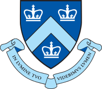

# Hi ʕ •ᴥ•ʔゝ Here is Genteki
 

Currently I am studying robotics. I also like creating useless tools about game and Vtuber.

## Education
| | School | Concentration | Year |
|:-- |:-- |:--  |:-- |
|  </img> | [Columbia University](https://www.columbia.edu/)  | MS in Mechanical Engineering | 2022 - |
| </img> | [Shanghai Jiao Tong University](https://www.sjtu.edu.cn) | BEng in Mechanical Engineering, Computer Science | 2017 - 2021 |

## Bilibili
I'm modeling my virtual avatar. You can follow me on [Bilibili](https://space.bilibili.com/474104136). I will post some Vocaloid, live2D modeling and VTS plugin tutorial video in the future.
